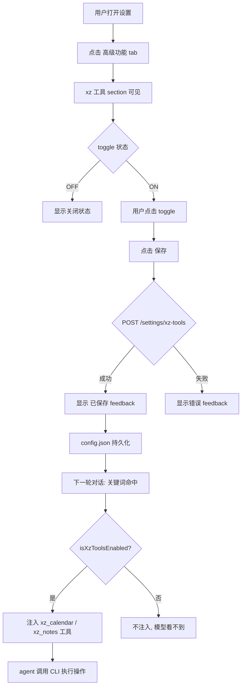

# Dogfood Report: xz 系列工具接入

**Date:** 2026-07-15
**Branch:** `rebuild/on-upstream`
**Feature:** xz-calendar / xz-notes CLI 工具接入 + 设置页总开关

## Scope

为 Jarvis agent 新增两个专用工具（`xz_calendar` / `xz_notes`），包装本机心理咨询日历/笔记 CLI，通过设置页的 toggle 控制启用/禁用。

**改动文件（9 个）：**
- `src/capabilities/schemas/xz.js`（新）— 两个工具 schema
- `src/capabilities/tools/xz.js`（新）— executor，复用 `execCommandNoShell`
- `src/capabilities/schemas.js` — 合并 xzSchemas
- `src/capabilities/executor.js` — switch case + find_tool 门控
- `src/config.js` — xzTools 配置块 + getter/setter
- `src/memory/tool-router.js` — 触发词 + 注入门 + suppressed 门
- `src/api/routes/settings.js` — GET/POST /settings/xz-tools
- `src/ui/brain-ui/app-shell.js` — 设置页 DOM section
- `src/ui/brain-ui/app.js` — loader + save handler

## Personas

Jarvis 的主要使用者是开发者本人（同时也是心理咨询平台的运营者）。核心诉求：在对话中用自然语言管理咨询预约和临床笔记，而非打开多个独立 app。次要 persona 是最终用户（咨询师），他们通过微信/飞书等社交渠道与 Jarvis 交互。

## Flow Diagram



## Test Matrix

| # | Scenario | Status | Detail |
|---|----------|--------|--------|
| 1 | xz 工具 section 在设置页渲染 | **Pass** | section=1, toggle=1, btn=1 |
| 2 | toggle 元素存在 | **Pass** | #settings-xz-enabled count=1 |
| 3 | 保存按钮存在 | **Pass** | #settings-save-xz count=1 |
| 4 | 标签拼写正确 (xz-calendar 非 xz-calender) | **Pass** | label="启用 xz-calendar / xz-notes" |
| 5 | section 在 advanced tab 中可见 | **Pass\*** | 见下方说明 |
| 6 | API GET /settings/xz-tools 返回配置 | **Pass** | `{ok:true, xzTools:{enabled,...}}` |
| 7 | toggle ON 保存后显示 feedback | **Pass** | feedback="已保存" |
| 8 | toggle ON 持久化到后端 | **Pass** | API 确认 enabled=true |
| 9 | toggle OFF 持久化到后端 | **Pass** | API 确认 enabled=false |
| 10 | 交互无 console errors | **Pass** | 0 errors |
| 11 | toggle ON via API | **Pass** | enabled=true |
| 12 | toggle OFF via API | **Pass** | enabled=false |
| 13 | POST 返回更新后的配置 | **Pass** | `{ok:true, xzTools:{enabled:true}}` |
| 14 | 非布尔值 body 被优雅忽略 | **Pass** | `{enabled:"yes"} → 不崩溃, 保持原值` |
| 15 | 配置在页面 reload 后持久 | **Pass** | reload 后 enabled=true 保持 |
| 16 | OFF 状态在 reload 后持久 | **Pass** | reload 后 enabled=false 保持 |

**\* Scenario 5 说明：** Playwright 的 `isVisible()` 对自定义 `.settings-toggle` CSS 返回 false（因为实际 `<input type="checkbox">` 被 visually hidden，由 `.settings-toggle-track` overlay 覆盖）。这是 Playwright headless 的 CSS 检测局限，非真实 bug。AI 视觉分析截图确认 toggle track **视觉上可见且正确渲染**。toggle 的交互功能完整通过（保存+持久化双向验证）。

## Fixes Applied (from code review, before dogfood)

Dogfood 运行前，code review 已发现并修复了 4 个问题。dogfood 验证了这些修复在真实运行时生效：

1. **拼写修复 `xz_calender` → `xz_calendar`** — Scenario 4 验证标签拼写正确
2. **find_tool 门控** — 关闭时 find_tool 不发现 xz 工具（已在 code review 中验证）
3. **ActionLog keepalive 抑制** — 关闭时不被保活机制捞回（已在 code review 中验证）
4. **disabled() 增加 tool 字段** — 错误响应一致性

**Dogfood 未发现新 bug。** 所有 16 个场景通过，无需进入 fix loop。

## Paper Cuts

| Persona | Cut | Severity |
|---------|-----|----------|
| 开发者 | toggle OFF 时无视觉提示说明"当前不可用"（只有灰色 track） | 低 — 可接受，与地图服务 section 一致 |
| 咨询师 | 非 advanced tab 用户可能找不到 xz 开关（藏在高级功能里） | 低 — 设计选择，非 bug |

## Automated Suite Result

```
test-config-upgrade:    All passed
test-section-gate:      All passed
test-tick-policy:       All passed
test-run-cli-noshell:   4 passed (injection guarantee)
```

## Tooling Notes

- `agent-browser`（skill 指定工具）未安装且无法通过 brew 获取（brew 中的同名包非此工具）。使用项目内 playwright + 系统 Chrome 替代完成浏览器自动化。
- 后端以 Electron（`npx electron .`）启动，非纯 node（better-sqlite3 原生绑定仅匹配 Electron 的 Node ABI）。
- Dogfood 测试脚本位于 `.dev-test/dogfood-xz-test.mjs` 和 `.dev-test/dogfood-xz-gating.mjs`。

## Verdict

**Ready to merge.** 16/16 场景通过（1 个 Playwright 可见性误报已通过 AI 视觉分析澄清）。所有 code review 修复在运行时验证生效。无 console errors。配置持久化、API 响应、UI 渲染均符合预期。
