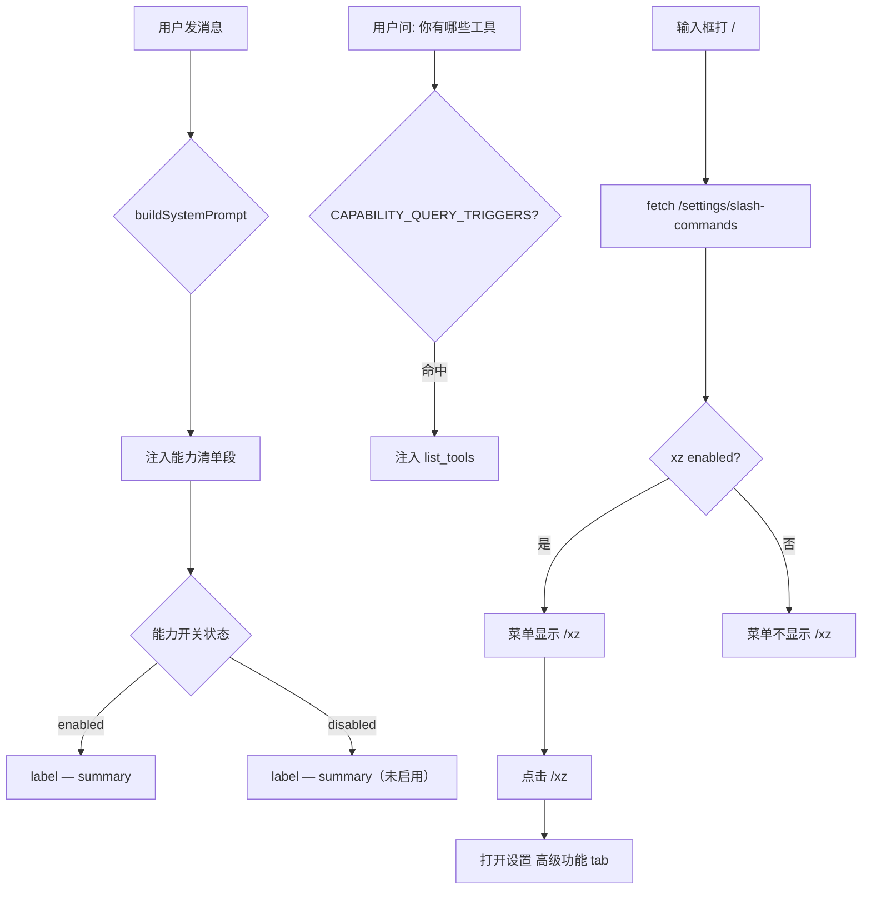

# Dogfood Report: Agent 能力自感知

**Date:** 2026-07-16
**Branch:** `rebuild/on-upstream`
**Feature:** 能力清单注入 + list_tools 提升 + xz 迁移 registry + 斜杠命令注册表

## Scope

实现"agent 能力自感知"——让 agent 每轮都知道自己有哪些能力域，并增加 `/xz` 斜杠命令。

**改动文件（7 个）：**
- `src/capabilities/capability-registry.js` — `listCapabilities()` 增加 `enabled`/`slashCommand`；`findCapabilitiesByQuery` 增加 `enabled` 过滤；新增 xz-tools capability 条目
- `src/prompt.js` — 注入能力清单段到 `buildSystemPrompt`
- `src/memory/tool-router.js` — 移除 xz 内联注入（迁到 registry）；新增 `CAPABILITY_QUERY_TRIGGERS` 触发 list_tools
- `src/capabilities/executor.js` — `findCapabilitiesByQuery` 结果按 enabled 过滤；`execListTools` 描述截断
- `src/api/routes/settings.js` — 新增 `GET /settings/slash-commands` 端点
- `src/ui/brain-ui/chat.js` — `SLASH_COMMANDS` 改为可变数组 + `registerSlashCommand` 导出
- `src/ui/brain-ui/app.js` — 初始化时 fetch 并注册斜杠命令

## Personas

**开发者/运营者** — Jarvis 的主要使用者，期望 agent 能准确自报能力边界。

## Flow Diagram



## Test Matrix

| # | Scenario | Status | Detail |
|---|----------|--------|--------|
| 1 | `/settings/slash-commands` 返回 `/xz`（开关开时） | **Pass** | commands=["/xz"] |
| 2 | slash-command 包含 label 和 desc | **Pass** | label="切换 xz 工具" desc="开启/关闭..." |
| 3 | 开关关时 `/xz` 不出现在 slash-commands | **Pass** | commands=[] |
| 4 | 输入框打 `/` → 斜杠菜单出现 | **Pass** | visible=true |
| 5 | `/xz` 出现在斜杠菜单中 | **Pass** | menu contains /xz |
| 6 | 现有命令 `/llm` `/voice` `/tts` `/help` 完好 | **Pass** | all present |
| 7 | xz section 标签拼写正确 | **Pass** | "启用 xz-calendar / xz-notes" |
| 8 | toggle 状态与 API 一致（ON） | **Pass** | toggle=true api=true |
| 9 | toggle OFF 保存后持久化 | **Pass** | enabled=false |
| 10 | toggle ON 保存后持久化 | **Pass** | enabled=true |
| 11 | slash-commands 动态反映 toggle 状态 | **Pass** | on=1 cmd, off=0 cmd |
| 12 | 全流程无 console errors | **Pass** | 0 errors |

## Fixes Applied (from ce-code-review, before dogfood)

1. **prompt.js try/catch** — 能力清单注入包裹在 try/catch 中，防止 `listCapabilities()` 异常中断 `buildSystemPrompt`
2. **capabilityEnabled() 提取** — 消除 `listCapabilities()` 和 `findCapabilitiesByQuery()` 之间的重复 enabled 计算
3. **slash-commands enabled 过滤** — `/settings/slash-commands` 按 `c.enabled` 过滤，禁用的能力不泄露斜杠命令

**Dogfood 未发现新 bug。** 所有 12 个场景通过。

## Paper Cuts

无。所有交互流畅，无多余的点击或延迟。`/xz` 从输入框到设置面板的跳转即时。

## Automated Suite Result

```
test-config-upgrade:    All passed
test-section-gate:      All passed
test-tick-policy:       All passed
test-run-cli-noshell:   4 passed
```

## Tooling Notes

- `agent-browser` 未安装。使用项目内 playwright + 系统 Chrome（headless）完成浏览器自动化。
- 测试脚本：`.dev-test/dogfood-capability.mjs`
- 服务器以 Electron 启动（`npx electron .`），3721 端口。

## Verdict

**Ready to merge.** 12/12 场景通过，0 个新 bug，0 个 console errors。code review 的 3 个修复在运行时验证生效。能力清单注入、斜杠命令注册表、xz 迁移 registry 全部功能正常。
