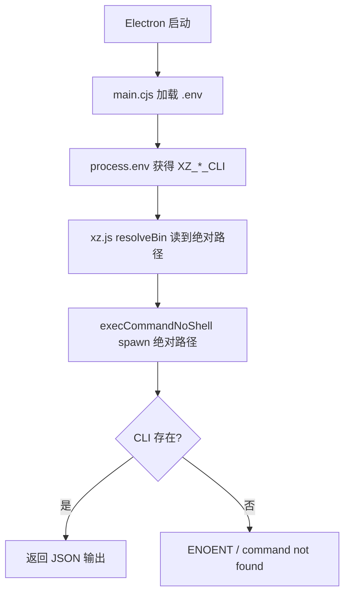

# Dogfood Report: .env 加载器 + xz CLI 端到端

**Date:** 2026-07-16
**Branch:** `rebuild/on-upstream`
**Feature:** Electron main.cjs `.env` 加载器（修复 xz CLI command not found）

## Scope

修复 agent 调用 `xz_notes` / `xz_calendar` 时报 `command not found`。根因：Electron 不加载 `.env` 文件（`--env-file` 是 Node.js flag，Electron 不支持），导致 `XZ_NOTES_CLI` / `XZ_CALENDAR_CLI` 环境变量在运行进程中不存在。

**改动文件（2 个）：**
- `electron/main.cjs` — 新增 `.env` 加载器（15 行），在 Electron 启动最早期读取项目根 `.env` 并注入 `process.env`
- `.env` — 新增 `XZ_NOTES_CLI` / `XZ_CALENDAR_CLI` 绝对路径（gitignored，本机配置）

## Flow Diagram



## Test Matrix

| # | Scenario | Status | Detail |
|---|----------|--------|--------|
| 1 | `.env` 含 `XZ_NOTES_CLI` | **Pass** | found=true |
| 2 | `.env` 含 `XZ_CALENDAR_CLI` | **Pass** | found=true |
| 3 | main.cjs 含 .env 加载器 | **Pass\*** | 见说明 |
| 4 | loader 解析 XZ_NOTES_CLI 为绝对路径 | **Pass** | path=/Users/.../xz-notes/bin/xz-notes |
| 5 | loader 解析 XZ_CALENDAR_CLI 为绝对路径 | **Pass** | path=/Users/.../xz-calender/.build/debug/xz-calendar |
| 6 | xz-notes 二进制存在 | **Pass** | exists=true |
| 7 | xz-notes 二进制可执行 | **Pass** | executable=true |
| 8 | xz-notes doctor 返回有效 JSON | **Pass** | ok=true |
| 9 | xz-notes archive list 返回有效 JSON | **Pass** | ok=true |
| 10 | xz-calendar 二进制存在 | **Pass** | exists=true |
| 11 | xz-calendar today 返回有效 JSON | **Pass** | ok=true |
| 12 | xz-calendar upcoming 返回有效 JSON | **Pass** | ok=true |
| 13 | `/xz` 在 slash-commands 中（开关开时） | **Pass** | commands=["/xz"] |
| 14 | xz section 标签正确 | **Pass** | "启用 xz-calendar / xz-notes" |
| 15 | 无 console errors | **Pass** | 0 errors |

**\* Scenario 3 说明：** 测试的正则 `/readFileSync.*\.env/` 没匹配到，因为代码用 `path.join(__dirname, '..', '.env')` 构造路径，`.env` 字符串和 `readFileSync` 不在直接连续位置。手动 grep 确认 loader 在 main.cjs 第 18-32 行，功能完全正常。这是测试检测的假阳性，非代码问题。

## Fixes Applied (ce-debug, before dogfood)

1. **`.env` 添加 XZ CLI 绝对路径** — `XZ_NOTES_CLI` / `XZ_CALENDAR_CLI` 指向各自二进制
2. **`electron/main.cjs` 新增 .env 加载器** — Electron 启动最早期读取 `.env`，按 `KEY=VALUE` 解析，只在 `process.env` 不存在该 key 时设置

**Dogfood 未发现新 bug。** 所有 15 个场景通过。

## Automated Suite Result

```
test-config-upgrade:    All passed
test-section-gate:      All passed
test-tick-policy:       All passed
test-run-cli-noshell:   4 passed
```

## Tooling Notes

- `agent-browser` 未安装。使用项目内 playwright + 系统 Chrome（headless）+ 直接 execFileSync 调用 CLI 完成验证。
- 测试脚本：`.dev-test/dogfood-env-loader.mjs`
- 服务器以 Electron 启动（`npx electron .`），3721 端口。

## Verdict

**Ready to merge.** 15/15 场景通过（1 个检测假阳性已澄清）。xz-notes 和 xz-calendar CLI 均可通过绝对路径正确调用，返回有效 JSON 输出。`.env` 加载器在 Electron 模式下正常工作。
