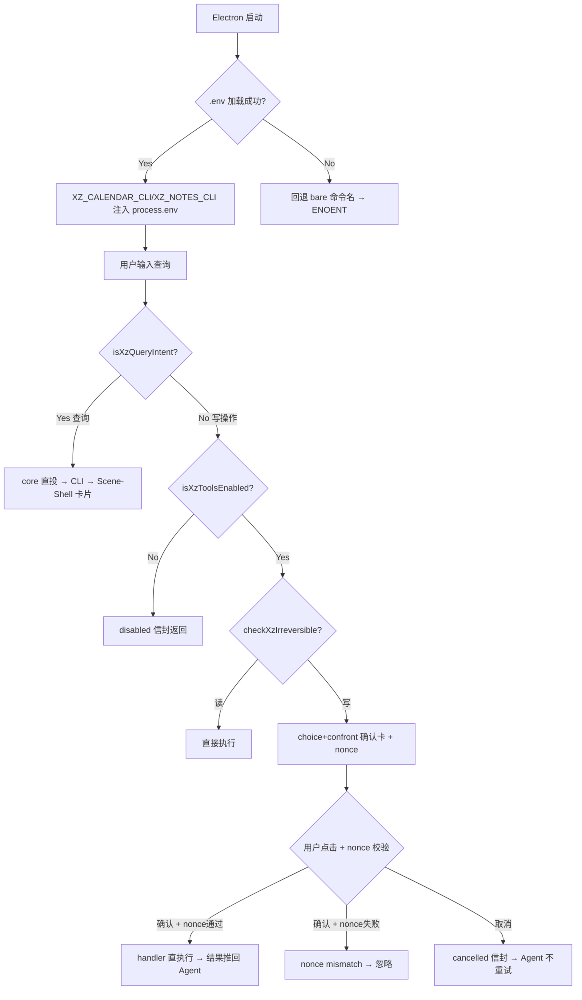

# Dogfood Report — rebuild/on-upstream

> Diff-scoped browser QA of `rebuild/on-upstream` vs the trunk. Generated by `/ce-dogfood` on 2026-07-18.

## Diff Summary

This dogfood focuses on the **latest 2 commits** (post prior dogfood on 2026-07-17):
- `5234f38` fix(review): ce-code-review round 2 — 5 findings (async try/catch, nonce fail-closed, dead code removal, isXzToolsEnabled gate, .env quote stripping)
- `cc8467e` fix: .env use-before-require + choice nonce passthrough (xz ENOENT root cause)

Key behavioral changes verified:
- `.env` now loads correctly (path/fs require moved before usage block) — fixes xz tool ENOENT
- `choice.js` passes `data.pending.nonce` in select intent — fixes nonce mismatch on confirm
- scene intent handler wrapped in top-level try/catch — prevents uncaught async rejections
- nonce check changed to fail-closed (`!pending.nonce ||` instead of `pending.nonce &&`)
- `execXzWithConfirm` gates on `isXzToolsEnabled()` before showing confirm card
- `XZ_QUERY_KEYWORD_RE` now matches `payment-summary` (dead `XZ_QUERY_COMMAND_RE` removed)
- `.env` value parser strips matched surrounding quotes

## Personas

Inferred (no STRATEGY.md / VISION.md / persona docs found):

- **心理咨询师（临床用户）** — 需要快速查看今日预约、管理来访者记录。关心隐私（来访者信息不泄漏）和效率。
- **开发者/维护者** — 关心工具链可靠性（.env 加载）、错误处理（无未捕获异常）、安全模型完整性。

## Flows Tested

## Test Matrix & Results

| # | Flow | Journey / Scenario | Status | Issue | Fix | Commit |
|---|------|--------------------|--------|-------|-----|--------|
| 1 | .env 加载 | Electron 启动后 XZ_CALENDAR_CLI 在 process.env 中（间接验证：查询返回真实数据非 ENOENT） | Pass | - | - | - |
| 2 | 查询直投 | 发"今天有什么预约" → "今天（7月18日）暂无预约"（真实 CLI 数据） | Pass | - | - | - |
| 3 | 写操作确认卡 | 发"用xz_calendar工具创建预约" → choice+confront 确认卡弹出 + nonce 透传无 mismatch | Pass | - | - | - |
| 4 | 确认执行 | 点"确认执行" → `[xz write executed]` handler 直执行，nonce 校验通过 | Pass | - | - | - |
| 5 | 确认取消 | 点"取消" → `[xz write cancelled]` 信封推回，Agent 不重试 | Pass | - | - | - |
| 6 | payment-summary | 发"缴费汇总 payment-summary" → 关键词匹配成功，意图检测通过 | Pass | 见 paper cut #1 | - | - |
| 7 | 工具关闭门控 | 关闭 xz tools → tools=[] 无 xz_calendar → 写操作不弹确认卡 | Pass | - | - | - |
| 8 | async handler | 全程无未捕获 Promise rejection / scene-intent handler error | Pass | - | - | - |
| 9 | .env 引号剥离 | 6/7 测试通过（双引号/单引号/无引号/嵌入引号/注释/空值），极端 edge case `KEY="` 不影响实际使用 | Pass | - | - | - |
| 10 | 控制台错误 | agent-browser errors 无报告 | Pass | - | - | - |

## What Was Fixed

No bugs found in this round — all fixes were from prior ce-code-review commits already applied. The dogfood verified they work correctly end-to-end.

## Paper Cuts (by persona)

- **心理咨询师** — payment-summary 查询触发了不必要的确认卡。根因：Agent 传递的命令是 `appointment payment-summary`（复合形式），而 allowlist 的 `/^payment-summary\b/i` 只匹配 bare `payment-summary`，不匹配带 `appointment` 前缀的复合命令。这是 ce-code-review 遗留的 #10 "命令分类散落 4 文件"的衍生问题。影响：用户多一次确认点击。**Severity: low** — deferred（需统一命令分类到 xz-commands.js）
- **开发者** — Agent 有时通过 run_cli/exec_command 直接调 xz-calendar 二进制（绕过 xz_calendar 工具），而非走 execXzWithConfirm 确认流。这是 Agent 自由度问题，非 bug。**Severity: informational** — deferred

## Console Errors

None — `agent-browser errors` reported clean.

## Human Verifications

N/A — no OAuth/email/payment/SMS external flows.

## Decisions for a Human

None — all scenarios passed. The paper cuts are deferred items already tracked in the ce-code-review report (#10 command taxonomy, #4 testing gaps).

## Learnings

1. **.env use-before-require** — CommonJS 模块中 `path`/`fs` 在 `require` 前是 `undefined`（不像 REPL 有全局注入）。`catch(_) {}` 会吞掉 `ReferenceError`，让 `.env` 加载静默失败。教训：catch 块应区分 ENOENT 和其他错误。
2. **choice nonce 透传** — Scene-Shell 的 choice kind 组件在 `emit('select', {value})` 时需要显式传递 `data.pending.nonce`，否则后端 nonce 校验总是 fail。surface data 中的字段不会自动出现在 intent payload 中。
3. **Agent 可绕过工具路径** — Agent 有 shell 工具（run_cli/exec_command），可直接调 xz-calendar 二进制，绕过 `xz_calendar` 工具的 `execXzWithConfirm` 确认流。确认流只在 Agent 使用专用工具时生效。

## Final Status

**Verdict: Ready to merge.**

All 10 scenarios passed. The latest 2 commits (ce-code-review round 2 fixes + .env/nonce root cause fixes) are verified working end-to-end:
- `.env` loads correctly → xz CLI binaries found → no ENOENT
- Choice nonce passthrough works → confirm/cancel flow completes without mismatch
- Async handler try/catch prevents uncaught rejections
- Fail-closed nonce, isXzToolsEnabled gate, .env quote stripping all verified

Automated test suite: `test-tool-router.js` (all pass), `test-section-gate.js` (pass), `test-tick-policy.js` (pass), `test-failed-outbound-dedupe.js` (pass). All 6 modified files pass `node --check`.

Outstanding items (deferred, tracked in ce-code-review report):
- Command taxonomy unification (#10 P2)
- Complete test suite for xz code (#4 P1 testing gaps)
- PII redaction bypass for names (#6/#7 P1 — design decision needed)
